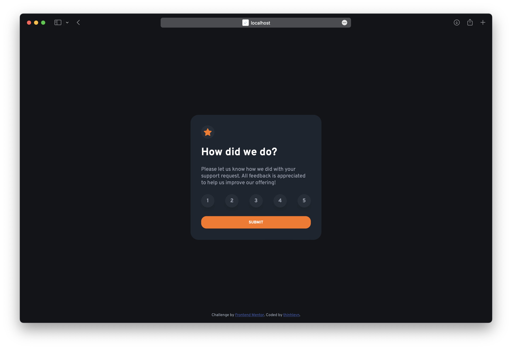
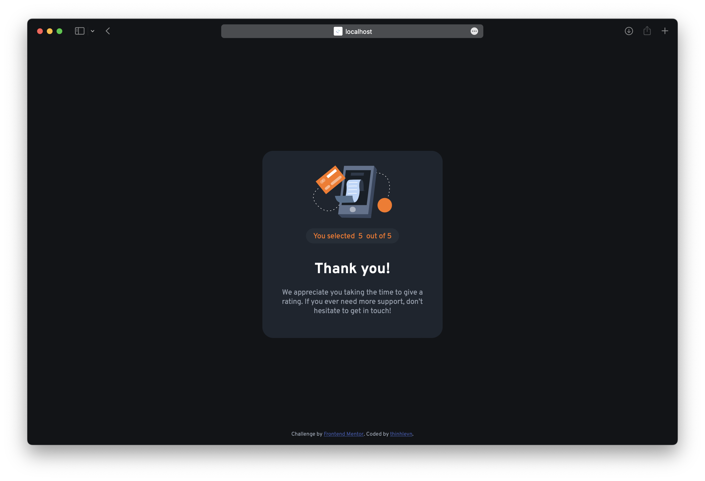

# Frontend Mentor - Interactive rating component solution

This is a solution to the [Interactive rating component challenge on Frontend Mentor](https://www.frontendmentor.io/challenges/interactive-rating-component-koxpeBUmI). Frontend Mentor challenges help you improve your coding skills by building realistic projects. 

## Table of contents

- [Overview](#overview)
  - [The challenge](#the-challenge)
  - [Screenshot](#screenshot)
  - [Links](#links)
- [My process](#my-process)
  - [Built with](#built-with)
  - [What I learned](#what-i-learned)
- [Author](#author)

**Note: Delete this note and update the table of contents based on what sections you keep.**

## Overview

### The challenge

Users should be able to:

- View the optimal layout for the app depending on their device's screen size
- See hover states for all interactive elements on the page
- Select and submit a number rating
- See the "Thank you" card state after submitting a rating

### Screenshot




### Links

- Solution URL: [fatbug97](https://github.com/fatbug97/Interactive-rating-component-solution/settings/pages)
- Live Site URL: [Interactive rating component solution](https://fatbug97.github.io/Interactive-rating-component-solution/)

## My process

### Built with

- Semantic HTML5 markup
- Flexbox
- CSS Grid
- [Box Shadow](https://box-shadow.dev) - For box shadow styles

**Note: These are just examples. Delete this note and replace the list above with your own choices**

### What I learned

- CSS selector for a checked radio button label

```html
<p>Select your preferred contact method:</p>
<div>
    <input type="radio" id="email" name="contact" value="email">
    <label for="email">Email</label>
 
    <input type="radio" id="phone" name="contact" value="phone">
    <label for="phone">Phone</label>
</div>
```
```css
input[type="radio"]:checked + label {
    font-weight: bold;
}
```
## Author

- Website - [fatbug97.me](https://fatbug97.me)
- Frontend Mentor - [@fatbug97](https://www.frontendmentor.io/profile/fatbug97)
- Twitter - [@fatbug97](https://www.twitter.com/fatbug97)
